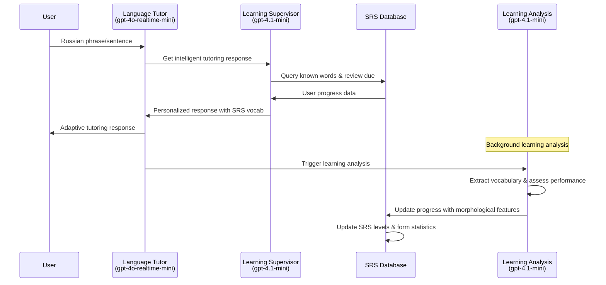

# Realtime Language Tutoring System

A comprehensive language learning application that combines OpenAI's Realtime API with intelligent spaced repetition system (SRS) memory modeling to create personalized, adaptive language tutoring conversations. The system uses Neo4j graph database to track vocabulary progress and morphological understanding, informing real-time conversation agents about optimal learning content.

## About This Application

This application demonstrates advanced patterns for voice-based language learning agents, featuring:

- **Intelligent Conversation Agents**: Using OpenAI Realtime API for natural, low-latency voice interactions
- **Spaced Repetition System**: Neo4j-powered vocabulary tracking with morphological analysis
- **Adaptive Learning**: Real-time conversation adjustment based on user progress and SRS data
- **Russian Language Focus**: Specialized morphological analysis for Russian grammar patterns
- **Dual-Agent Architecture**: Chat agents for conversation + supervisor agents for learning analysis

The system tracks vocabulary usage, grammatical form accuracy, and learning patterns to create personalized tutoring experiences that adapt to each user's proficiency level and learning needs.

## Architecture Overview

### Core Components

1. **Language Tutor Agent** (`languageTutorSupervisor.ts`): Handles real-time conversation with SRS-informed vocabulary selection
2. **Learning Analysis Agent** (`learningSupervisor.ts`): Analyzes conversation turns for vocabulary learning insights
3. **Neo4j SRS System** (`lib/neo4j/srs.ts`): Tracks vocabulary progress with embedded form statistics
4. **Morphological Analysis**: Russian-specific grammar pattern recognition and error tracking

### Database Schema

The system uses a simplified Neo4j schema with embedded form statistics:

```
User -[:HAS_PROGRESS]-> LearningProgress -[:ABOUT]-> Lexeme
```

**LearningProgress** nodes contain:
- `srsLevel`: Spaced repetition level (1-5)
- `overallSuccessRate`: Overall word mastery percentage
- `formStats`: JSON object tracking individual conjugated/declined forms
- `weakestForms`: Array of forms needing more practice
- `nextReview`: When the word is due for review

## Setup

### Prerequisites
- Node.js 18+
- Neo4j instance (local or cloud)
- OpenAI API key

### Installation

1. Clone the repository:
```bash
git clone <repository-url>
cd realtime-agents-language-tutor
```

2. Install dependencies:
```bash
npm install
```

3. Configure environment variables:
```bash
cp .env.example .env
```

Edit `.env` with your credentials:
```env
OPENAI_API_KEY=your_openai_api_key_here
NEO4J_URI=bolt://localhost:7687
NEO4J_USERNAME=neo4j
NEO4J_PASSWORD=your_password
```

4. Initialize Neo4j database:
```bash
npm run dev
# Navigate to http://localhost:3000/api/neo4j/init
```

5. Start the development server:
```bash
npm run dev
```

6. Open [http://localhost:3000](http://localhost:3000) and select "Language Tutor" from the scenario dropdown.

## How It Works

### Conversation Flow



### SRS Memory Modeling

The system tracks vocabulary at both lexeme and form levels:

1. **Lexeme Level**: Root word progress (e.g., "читать" - to read)
2. **Form Level**: Conjugated/declined forms (e.g., "читаю", "читаешь", "читает")
3. **Morphological Features**: Person, number, case, gender, tense, aspect
4. **Error Patterns**: Common mistakes tracked per form

### Learning Analysis

The system analyzes conversation turns to:
- Extract meaningful vocabulary usage
- Assess grammatical accuracy
- Identify error patterns
- Update SRS scheduling
- Track morphological understanding

## Key Features

### Intelligent Vocabulary Selection
- Prioritizes words due for review in conversations
- Introduces new vocabulary at appropriate difficulty levels
- Adapts complexity based on demonstrated proficiency

### Morphological Analysis
- Tracks Russian verb conjugations (person, number, tense, aspect)
- Monitors noun declensions (case, number, gender)
- Analyzes adjective agreement patterns
- Records form-specific error patterns

### Spaced Repetition
- Leitner box system with 5 SRS levels
- Dynamic scheduling based on performance
- Form-specific success rate tracking
- Weakest forms identification for focused practice

### Conversation Memory
- Maintains conversation history for context
- Uses sliding window for vocabulary analysis
- Incorporates error patterns into tutoring decisions

## Configuration

### Agent Configs

The system uses two main agent configurations:

1. **Language Tutor Agent** (`src/app/agentConfigs/languageTutor/index.ts`):
   - Real-time conversation handling
   - SRS-informed vocabulary selection
   - Adaptive difficulty adjustment

2. **Learning Supervisor** (`src/app/agentConfigs/learningSupervisor.ts`):
   - Background learning analysis
   - Morphological feature extraction
   - SRS database updates

### Customization

To adapt for different languages:

1. Update morphological analysis in `src/lib/neo4j/srs.ts`
2. Modify language-specific prompts in agent configs
3. Adjust SRS parameters for language complexity
4. Update API language defaults

## API Endpoints

- `POST /api/learning/process-event` - Process learning events
- `GET /api/learning/progress` - Get user progress summary
- `GET /api/learning/review-due` - Get words due for review
- `GET /api/learning/known-words` - Get user's known vocabulary
- `POST /api/neo4j/init` - Initialize database schema

## Development Tools

### Testing
- `test-simplified-system.js` - Test SRS system with sample data
- `cleanup-old-nodes.js` - Clean up old database nodes

### Database Management
- Built-in schema initialization
- Automated cleanup scripts
- Progress tracking utilities

## Performance Considerations

- **Real-time Response**: Chat agent provides immediate feedback
- **Background Analysis**: Learning analysis runs asynchronously
- **SRS Optimization**: Embedded form statistics reduce query complexity
- **Conversation Memory**: Sliding window prevents context overflow

## Limitations & Future Enhancements

### Current Limitations
- Basic morphological analysis (rule-based)
- Limited to Russian language
- Minimal frontend design
- No user authentication system

### Potential Enhancements
- Advanced morphological analyzers (pymystem3, natasha)
- Multi-language support
- User interface improvements
- Audio pronunciation analysis
- Writing practice integration
- Progress visualization

## Contributing

The system is designed to be extensible. Key areas for contribution:

1. **Language Support**: Add morphological analysis for other languages
2. **UI/UX**: Improve frontend design and user experience
3. **Analytics**: Enhanced learning progress visualization
4. **SRS Algorithms**: Alternative spaced repetition implementations
5. **Assessment**: More sophisticated proficiency evaluation

## Technical Stack

- **Frontend**: Next.js 14, TypeScript, React
- **Backend**: Next.js API routes
- **Database**: Neo4j graph database
- **AI**: OpenAI Realtime API, GPT-4.1-mini
- **Voice**: WebRTC, OpenAI Realtime API
- **Language Processing**: Custom Russian morphological analysis

## License

This project demonstrates advanced patterns for voice-based language learning applications. Feel free to use as a foundation for your own language tutoring systems.

---

*Note: This application focuses on backend architecture and learning algorithms. Frontend design is minimal but functional. The system provides a complete foundation for building sophisticated language learning applications.*